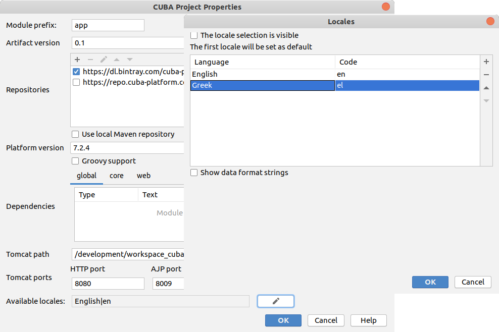

[](http://www.apache.org/licenses/LICENSE-2.0)

# CUBA Greek Translation Add-on

Greek translation of CUBA Platform (plus commercial components) implemented as an add-on.

## Installation
This add-on's repository is officially linked to the main CUBA repository, so you can install it from the Marketplace
or by adding the repository manually to your project.

The following table shows which version of the add-on is compatible with which version of the platform:

| Platform Version | Add-on Version | Coordinates
| ---------------- | -------------- | ------------
| 7.2.*            | 1.0.0          | gr.netmechanics.cuba.translationel:translationel-global:1.0.0

The latest stable version is: `1.0.0`

### From Marketplace
You can use **CUBA Studio** / **IntelliJ IDEA** to add it to your project: choose the `CUBA -> Marketplace...` menu item,
find the *Greek Translation* add-on, then click on the `Install` button.

### Adding the repository manually
Modify the `build.gradle` of your CUBA application. First add the repository `https://dl.bintray.com/netmechanics/cuba-components` 
to the buildscript.
```gradle
buildscript {
    ...
    repositories {
        ...
        maven {
            url 'https://dl.bintray.com/netmechanics/cuba-components'
        }
        ...
    }
    ...
}
...
```
Then select the version of the add-on which is compatible with the platform version of your project 
and add custom application component to your project
```gradle
...
dependencies {
    ...
    appComponent('gr.netmechanics.cuba.translationel:translationel-global:1.0.0')
    ...
}
...
```

## Enable Greek Language
From the `CUBA -> Project Properties...` menu item, click the edit button next to `Available locales`. 
Then click the add button and fill the field `Language` with "Greek". The field `Code` should be auto filled with "el".

 